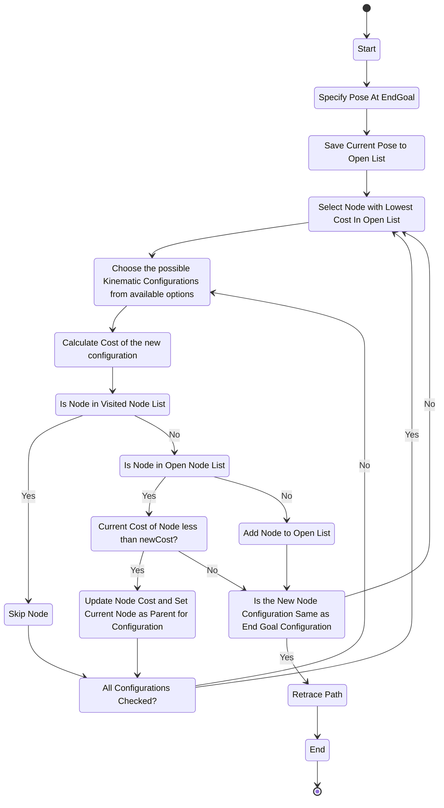
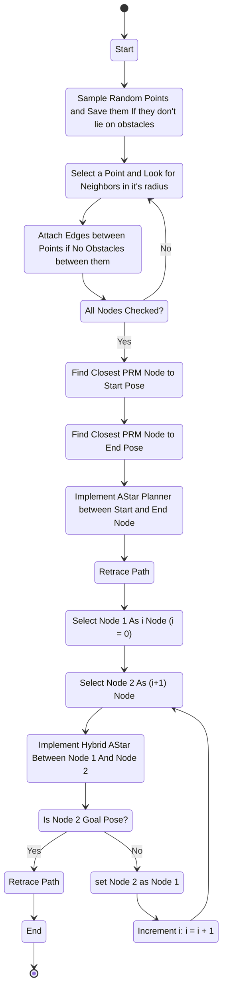

**Table of Contents**
<!-- TOC -->

- [Introduction](#introduction)
- [Vehicle and Kinematics](#vehicle-and-kinematics)
    - [Vehicle Constraints](#vehicle-constraints)
    - [Vehicle Kinematics](#vehicle-kinematics)
- [Simulation and Environment](#simulation-and-environment)
- [A* Planner](#a-planner)
- [PRM Generation and Planner Approach](#prm-generation-and-planner-approach)
- [Simulation Images](#simulation-images)
- [Results and Graphs](#results-and-graphs)
- [Observations](#observations)
- [Conclusion](#conclusion)
- [Design Details](#design-details)
- [License](#license)

<!-- /TOC -->

# Introduction
The objective of this task is to showcase the use of combinatorial and sampling-based techniques for path planning. Our approach involves implementing A* planning in a continuous space while considering the kinematic limitations of a vehicle across state lattices. Additionally, we employ a probabilistic road map method to assist the aforementioned technique.

# Vehicle and Kinematics
Our robot is designed with an Ackermann steering style, which is based on the Mercedes Unimog, a robust vehicle suitable for off-road terrain.

In terms of kinematics, we make the assumption that we have the capability to regulate the velocity of our drive wheels ($v$) and the direction of our steering wheels ($\phi$).

Our Requirements are as follows:
- Robot Width: $W = 2.2 m$
- Robot Length: $L = 4.9 m$
- Robot Wheelbase: $W_{b} = 3.0 m$
- Robot Minimum Turning Radius: $R = 13 m$
- Robot Maximum Velocity: $v_{max}=10 \frac{m}{s}$

## Vehicle Constraints

Based on the Requirements, the calculated constraints are as follows:

**Maximum Robot Velocity**

$v_{max} = 10 \frac{m}{s}$

**Maximum Steering Angle**

$R = \frac{W_{b}}{\sin{\phi}} + \frac{T_{w}}{2}$

where,\
- $W_{b}$ -> Wheel Base
- $\phi$ -> Steering Angle
- $T_{w}$ -> Tire Width

Here, Tire Width is assumed to be zero. Thus, the max steering angle can be found by:

$\phi = \arcsin{\frac{W_{b}}{R}}$

Thus, $|\phi_{max}| = 13\degree$

## Vehicle Kinematics

**X-Coordinate**

$dx = v * \cos(\theta)$

where $\theta$ is the vehicle rotation angle with X-axis.\
Thus,\
$x(t) = x(t-1) + v\cos{\theta}$

---

**Z-Coordinate**[^1]

[^1]: Unity maps traditional XY Plane as XZ Plane.

$dz = v * \sin(\theta)$

where $\theta$ is the vehicle rotation angle with X-axis.\
Thus,\
$z(t) = z(t-1) + v\sin{\theta}$

---

**$\theta$ Coordinate**

$d\theta = \frac{v}{L}\tan{\phi}$

$\theta(t) =\theta(t-1) \frac{v}{L}\tan{\phi}$

---

# Simulation and Environment

In our context, the environment is a self-contained area of 250 by 250 meters, where we possess complete and accurate information. The obstacles are clusters of tetrominoes, arranged in 10 by 15 meter squares. The arsonist sets a random obstacle on fire periodically.

# A* Planner
In this section, we introduce a flow chart depicting the path planner we built, which employs an A* search algorithm. During the process of expanding neighboring cells, we apply kinematic equations to each step to generate an in-memory state lattice $(x,z,\theta)$ . This enables us to explore the continuous space as if it were a discrete space. To handle the state lattice and navigate its nodes, we implemented a List. The cost of each node is determined by the squared Euclidean distance between the states from the starting point to that point, along with a penalty for $\theta$ changes, which incentivizes straight movement over swerving when possible. To guide our search, we heavily penalize the Euclidean distance to the goal.

Since we are not working in a discrete space, it becomes necessary to determine an acceptable method for identifying node equality. To this end, we discretize the coordinates as whole numbers to ensure limited and viable search. We round the x and y coordinates to the nearest 0.5 meter θ to the nearest $1\degree$. As a result, we can perform a high-speed $O(1)$ lookup to determine if a location is occupied or not.

# PRM Generation and Planner Approach

To experiment with utilizing a probabilistic roadmap (PRM) for navigation, we created a PRM of our environment. We began by generating random $x$ and $z$ points within the range of $(-125,125)$. Next, we selected a random $\theta$ for the vehicle and checked if a collision existed in this configuration. If a collision occurred, we abandoned this point and generated another one. If not, we added it to our list of points. We repeated this process for 1000 points, which we considered to be sufficient coverage.

As the PRM is static and does not change after initialization, a linked list structure was ideal for our usage.

Using the A* algorithm, we executed the PRM points, assuming that each node had a connection with the closest nodes. Combined with a squared Euclidean distance heuristic for cost, our planner swiftly found the points between nodes within the PRM.

When a burning obstacle was selected, we identified the closest node to both it and the vehicle's location. We then used the PRM A* planner to find the path among the PRM to the objective. We subsequently executed a second A* planner, which was identical to our continuous space A* planner described above. Instead of computing the path from the vehicle's location to the goal, we tasked the planner with creating a kinematic path to move us between nodes in the PRM.

# Simulation Images

***Figure: Simulation View***

***Figure: Wumpus Motion View***

***Figure: Fire Truck Motion View***

# Results and Graphs

***Figure: Evaluation on Basis of Interaction with Obstacles***

***Figure: Evaluation on Basis of Time Required to Plan Path w.r.t. Time***

# Observations

Throughout the development and execution of our simulation, we observed both advantages and disadvantages of pairing PRM with A* as opposed to using A* alone. 

- While A* by itself took longer to generate a path, especially when routing around obstacles, PRM quickly routed around the same obstacles by establishing connections instead of trying to map a continuous space.

- However, PRM did not consistently perform better for our task at hand. The selection of the node to map to for each obstacle was determined by the simple algorithm of the closest node to the obstacle’s center, which may not have been optimal from the vehicle's current location.

- Furthermore, PRM did not produce optimal paths to the goal as it only found an optimal path amongst the sampled nodes, which may not guarantee optimality for the actual space. The A* planner then had to find optimal continuous space paths between each node, resulting in sub-optimal paths being generated.

- Additionally, PRM struggled due to inadequate collision detection between nodes, resulting in occasional tight corridors and the A* planner abandoning the PRM's estimated plan to route around the obstacle. 

These reasons resulted in the PRM planner taking longer to reach the goal despite calculating the path to it faster. Unreachable obstacles hampered the PRM planner more, resulting in more fires that the vehicle could not put out, leading to worse results.

# Conclusion

During this assignment, we explored the advantages and disadvantages of utilizing the sampling-based method of PRM in conjunction with continuous space planning using A* and state lattices. We conducted tests in various challenging scenarios with randomly generated environments. Through these tests, we observed the benefits of having a sampling-based map for path planning, as well as the drawbacks that can arise from implementation choices, which can greatly impact performance outcomes.

# Design Details

- Designed for:
  - Worcester Polytechnic Institute
  - RBE 550-S23-S01: Motion Planning
- Designed by:
  - [Parth Patel](mailto:parth.pmech@gmail.com)

# License

This project is licensed under [GNU General Public License v3.0](https://www.gnu.org/licenses/gpl-3.0.en.html) (see [LICENSE.md](LICENSE.md)).

Copyright 2023 Parth Patel

Licensed under the GNU General Public License, Version 3.0 (the "License"); you may not use this file except in compliance with the License.

You may obtain a copy of the License at

_https://www.gnu.org/licenses/gpl-3.0.en.html_

Unless required by applicable law or agreed to in writing, software distributed under the License is distributed on an "AS IS" BASIS, WITHOUT WARRANTIES OR CONDITIONS OF ANY KIND, either express or implied. See the License for the specific language governing permissions and limitations under the License.
